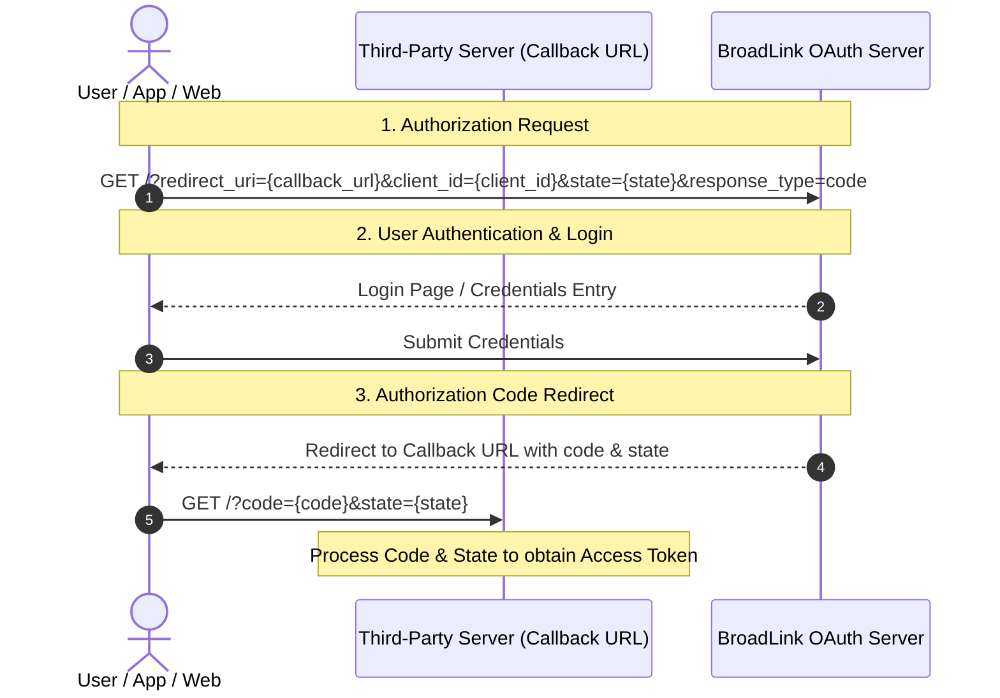

# BroadLink Smart Home Cloud Interoperability API

> **Last Updated:** 2025-02-10 (First Draft)

This document describes the interface specifications for BroadLink smart home cloud interoperability. Device discovery and control interfaces can only be accessed via a cloud IP whitelist and can interoperate with third-party platform accounts (OAuth 2.0).

---

## 1. Introduction & Architecture

The account interoperability process involves embedding BroadLink's OAuth account login page in the app or web page, while providing a callback URL to receive the authorization code generated by BroadLink upon successful login. After the user logs in, the OAuth service redirects to the callback URL, carrying the code parameter.

### Overall Docking Framework



---

## 2. Interface Format & Security

### Signature Verification

All API accesses require the inclusion of a signature and timestamp keywords in the HTTP header:

*   **`signature`**: Verification signature.
*   **`timestamp`**: Current request timestamp.

#### Signature Calculation Method
```
sha1(body + timestamp + license).hexstring()
```
*   `body`, `timestamp`, and `license` represent string concatenation.

---

## 3. OAuth Account Association Interface

Before calling the API, a token needs to be obtained by associating with the SmartStar account using the **OAuth 2.0 Access Token** mode. This token must be included when calling subsequent APIs.

According to the OAuth 2.0 standard, account interoperability requires the following preparatory work before obtaining the token:

### Step 1: License & OAuth Application Setup
1. Register an enterprise developer account.
2. Apply for a license and add an OAuth application in the business management section.
3. Contact your assigned sales, pre-sales representative, or BroadLink engineer for review and approval.
4. *After approval, you will receive the `license` and `clientid`/`secretid` for subsequent interface testing.*

### Step 2: Login Request Interface
Redirect the user to the BroadLink login page:
```http
GET https://(OAuthLoginURL)/?redirect_uri=(callback_url)&client_id=(client_id)&state=(state)&response_type=code
```
*   **Success Response**: The OAuth server will redirect to the callback address, carrying the `code` and `state` parameters.

### Step 3: Callback Request API
Your service must handle the redirection at the callback address:
```http
GET https://(callback_url)/?code=(code)&state=(state)
```
*   `callback_url` and `state` are provided by the third party.
*   The `callback_url` parameter needs to be encoded using `url_encode`.

> [!WARNING]
> The `callback_url` **cannot** include its own `code` and `state` parameters; otherwise, parameter name conflicts will occur after the callback, resulting in an error.

### Step 4: Token Exchange & Refresh
*   **Obtaining a token**: Once you have obtained the authorization code, call the [Token Request](file:///C:/Users/zacsa/Documents/antigravity/eager-pasteur/oauth_token.md) endpoint to exchange it for an access token.
*   **Refreshing a token**: When the access token expires, use the [Refresh Token Request](file:///C:/Users/zacsa/Documents/antigravity/eager-pasteur/refresh_token.md) endpoint to get a new access token.

### Step 5: Device Discovery
Use the access token to query the user's account for active devices and scenes using the [Device Discovery](file:///C:/Users/zacsa/Documents/antigravity/eager-pasteur/device_discovery.md) API.

### Step 6: Device Control
Send control directives to a device or scene using the [Device Control](file:///C:/Users/zacsa/Documents/antigravity/eager-pasteur/device_control.md) API. This API requires the token and device-specific `cookie` payload obtained during discovery.


